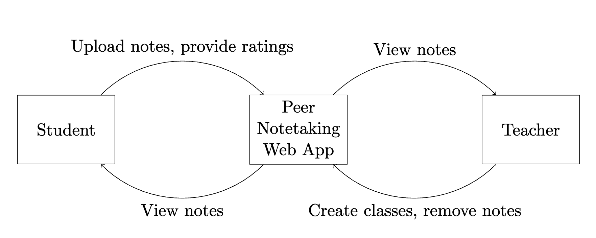
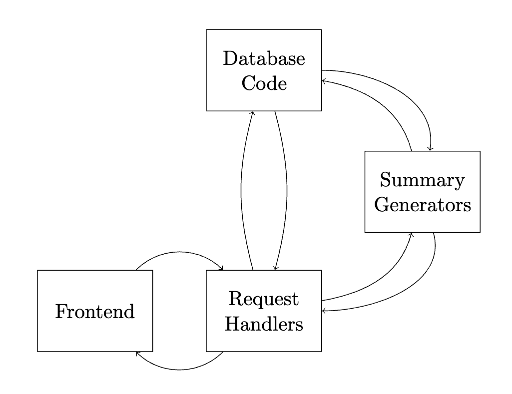

# csds393Project

## Project Name and Description

We designed CNotes, a web application that allows CWRU students to upload their class notes and view class notes uploaded by others.
Notes are organized by department, class, and creation date.
Students can upload, access, and organize notes into their appropriate folders.
Professors, teaching assistants and administrators can view notes, remove notes (such as those that violate academic integrity), and create or remove class folders as new courses are created or discontinued.
Each note has a corresponding discussion board page that allows users to ask questions, discuss, correct, and leave feedback on that particular note.

## Architecture

Our architecture is summarized by the following diagrams:

## Getting Started / Installation

Our repository is divided into client and server subdirectories.
Each must be set up separately.

### Client

First, install Node.js.
Then enter the `client` directory and initialize a new project using `npm init`.
Finally, install the necessary dependencies using `npm install`.

If necessary, update the `BACKEND_URL` value in the `.env` file with the address and port number on which you are running your backend.

Run `npm start` to start the frontend.

To run front-end unit tests:
1) Move babel.config.js from the config to client root folder
2) From the client directory on the terminal, run npx jest testfile.tsx, replacing testfile with one of test.tsx files provided in each component.
3) Make sure to move babel.config.js back to the config folder before running the application (otherwise, the application will not run)

### Server

First, install Postgres and Python 3.10, and enter the `server` directory.
Create a new database in Postgres, and run all of the `CREATE TABLE` queries in `database_schema.md`.
Then update the `DATABASE_URL` parameter in the `.env` file with the proper URL string for your newly-created database.
Then create a new virtual environment using `python -m venv ./venv`, and activate the environment with `source ./venv/bin/activate`.
Finally, install all necessary packages using `pip install -r requirements.txt`.

Then you can start the backend using the command `fastapi dev main.py`.
By default, the server will be started at `http://127.0.0.1:8000`, and the documentation can be viewed at `http://127.0.0.1:8000/docs`.

Once your backend is up and running, you will likely want to create some departments, courses and sections for which users can upload notes.
This must be done directly in the database, using a tool like pgAdmin or psql.
To understand how to write these queries, consider the table definitions given in the `./server/database_schema.md` file.

## Usage / Examples

Once your frontend and backend are up and running, navigate to the frontend in a web browser.
Click the "Sign Up" button in the top right corner of the main page to create a new account.
From here, the user interface is very intuitive and self explanatory.

## Folder Structure Overview

Our frontend code is contained in the `client` directory and our backend code is contained in the `server` directory.
The main entry point for our backend is in the `./server/main.py` file, and our tests are contained in the `./server/test_*.py` files.
Our frontend tests are contained in the individual subdirectories of `./client/src/app`.

## Tech Stack / Dependencies

Our frontend is written in Typescript using Next.js, React and Tailwind CSS.
Our backend is written in Python using FastAPI, with PostgreSQL as our database and object storage solution.

## Contributions

This project was built by the team effort of omeikeseth@gmail.com, jasonlai682@gmail.com, jst94@case.edu, smb318@case.edu.

Seth Omeike was responsible for user interface design and front-end implementation.
Jason Lai developed our front-end unit tests and also contributed to the front-end implementation.
James Telzrow was responsible for our database schema design and implementing the core business logic in our backend.
Sean Brown was responsible for designing the note summarization feature as well as developing our backend unit tests.
He also designed our initial means of storing note’s content using the Google Drive API, although we eventually moved away from this.

## Development Retrospective

The biggest challenge in our project was how we stored the actual content of a note.
Initially, files were stored on the Google Drive API, due to the large amount of free storage, and easy support of various file types.
However, we eventually chose to store the files directly in our database in binary.
This makes it easier to display them in the frontend.
There are no concerns about access control, and we don’t have to call the Google Drive API to access the file, so there are less steps.

## License

Unsure of license, placeholder here.

